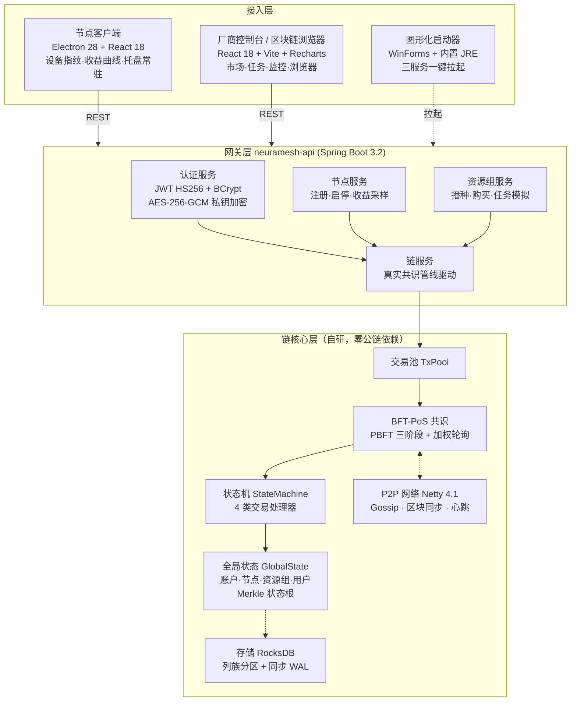
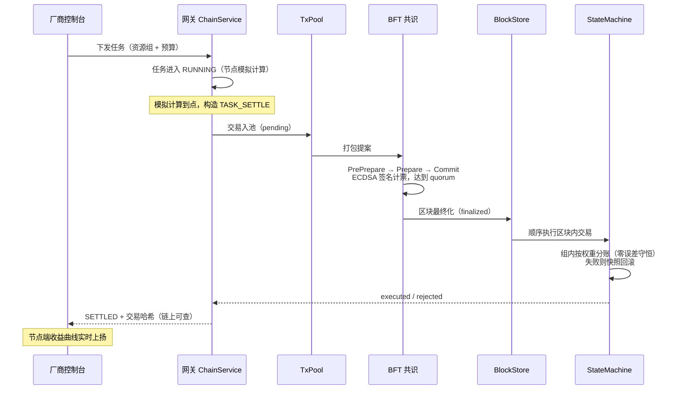
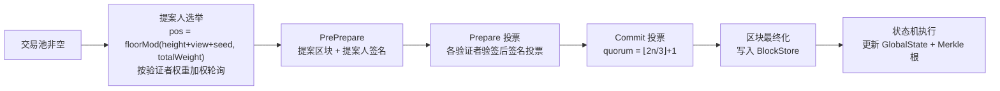
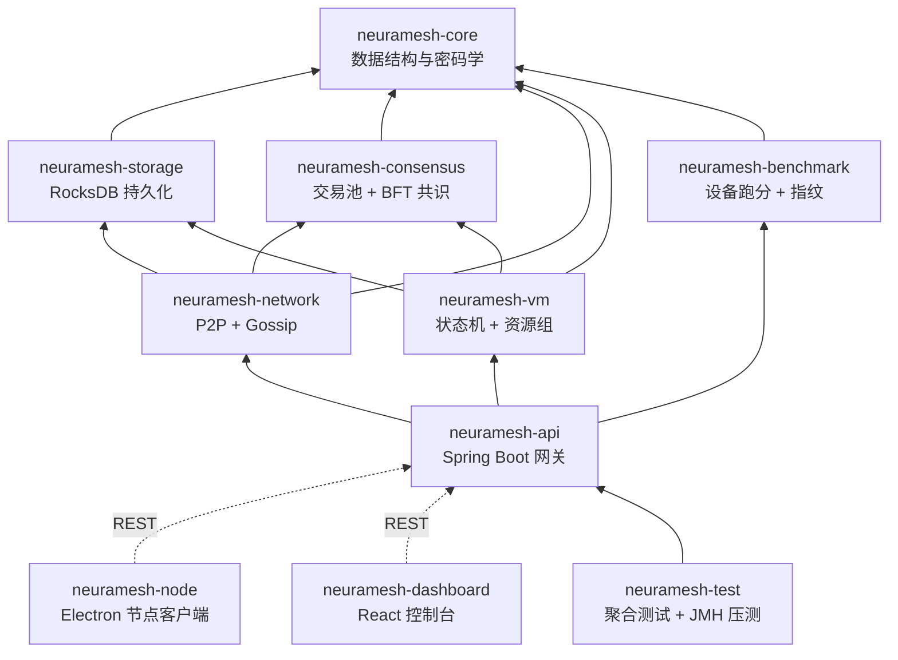

# NeuraMesh：基于自研 BFT-PoS 区块链的去中心化边缘智算网络的设计与实现

> 创意设计论文 · 软件全栈已实现并可现场演示（v0.6，Windows 免环境一键启动）

---

## 摘要

随着大模型推理需求爆发，中心化算力供给面临成本高、区域覆盖不均与单点故障三重瓶颈；与此同时，海量边缘设备（个人电脑、工作站、边缘服务器）的算力长期闲置。本文设计并完整实现了 **NeuraMesh——一个基于自研 BFT-PoS 区块链的去中心化边缘智算网络（DePIN）**：算力供给方将闲置设备注册为节点并按地区/规格加入资源组，算力需求方（厂商）购买资源组并下发 AI 推理任务，网络以链上交易完成任务结算，报酬按节点多维信誉权重自动分账。系统提出并实现了**四交易类型极简账本模型**、**PBFT 三阶段 + 加权轮询提案的轻量共识**、**多维权重信誉模型与见证人交叉背书机制**、**设备指纹终身绑定防女巫机制**与**资源组安全域市场**。实测单机指标：状态机吞吐 8013 tx/s，8 验证者全流程共识单轮最终化 1.697 ms（590 轮/s），全栈 123 项自动化测试通过，聚合行覆盖率 77% 以上。

**关键词**：DePIN；边缘计算；BFT-PoS 共识；设备指纹；信誉权重；区块链结算

---

## 一、研究背景与意义

### 1.1 问题提出

1. **算力供需错配**：AI 推理需求指数级增长，而中心化云厂商算力价格高企、热点地区供不应求；
2. **边缘算力闲置**：个人 GPU 工作站、边缘服务器平均利用率不足 20%，缺乏可信的变现通道；
3. **信任难题**：去中心化撮合算力买卖，必须解决"设备身份可信（防女巫攻击）""算力申报可信（防刷分）""结算可信（防赖账）"三大信任问题。

### 1.2 设计目标

构建一个**不依赖任何公链、完全自研可控**的边缘算力交易网络，做到：

- 节点接入零门槛：普通 Windows 电脑双击即可成为算力节点；
- 全流程链上可查：注册、权重、购买、结算每一步真实上链；
- 结算精确守恒：按权重分账零误差，代币总量不变；
- 现场可演示：单机即可运行全套网络（链 + 控制台 + 节点客户端）。

---

## 二、创新性说明

| # | 创新点 | 核心机制 | 对应实现 |
|---|--------|----------|----------|
| 1 | **四交易类型极简账本** | 将 DePIN 业务收敛为 NODE_REGISTER / WEIGHT_UPDATE / TASK_SETTLE / TOKEN_TRANSFER 四种交易，状态机确定性执行 + Merkle 状态根承诺，兼顾极简与完备 | `neuramesh-vm` |
| 2 | **轻量 BFT-PoS 共识** | PBFT 三阶段（PrePrepare/Prepare/Commit）+ 按权重加权轮询选提案人；quorum=⌊2n/3⌋+1；真实 ECDSA 签名计票。实测 8 验证者单轮最终化 1.697 ms | `neuramesh-consensus` |
| 3 | **多维权重信誉模型 + 见证人交叉背书** | totalWeight = 硬件×0.3 + 质量×0.4 + 在线×0.2 + 带宽×0.1，质量分占比最高从机制上抑制"纯跑分刷权重"；权重更新需 ≥2 个独立验证者对同一分数一致签名背书，偏差见证者质量分自动降权 0.9 | `WeightUpdateValidator`、`NodeState` |
| 4 | **设备指纹终身绑定（防女巫）** | 设备指纹 SHA-256 上链全局去重（重复注册被链上拒绝），客户端双层持久化（Electron userData 文件 + localStorage），终身一次、永久复用 | `NodeRegisterProcessor`、`fingerprintManager` |
| 5 | **资源组安全域市场** | 节点按地区/规格加入资源组（兜底默认组保证必有归属）；每组持有 ECDSA 安全组密钥对，购买后交付组私钥形成加密安全域；组内按权重自动分账，整数分配 + 余数补齐实现**零误差守恒** | `ResourceGroupState`、`TaskSettleProcessor` |
| 6 | **任务全生命周期真实上链** | 每笔业务走完整管线：交易池 → BFT 三阶段共识 → 区块存储 → 状态机执行；生命周期 pending→finalized→executed 可实时查询，前端零假数据 | `ChainService`、`/chain/tx/{hash}/status` |
| 7 | **免环境一键交付** | jlink 裁剪 79MB 专用 JRE 打入发布包（目标机免装 Java）；WinForms 图形启动器三服务一键拉起；Electron 客户端自身内置后端启动器 | `launcher.ps1`、`backendLauncher.ts` |

---

## 三、系统总体架构（原理图）

### 3.1 总体架构图

### 3.2 交易生命周期原理图（任务结算为例）

### 3.3 共识原理图

---

## 四、模块地图与函数地图

### 4.1 模块地图（10 模块，Gradle 多项目）

### 4.2 函数地图（核心类与关键函数）

#### neuramesh-core（创世基石）

| 类 | 关键函数 | 职责 |
|---|---|---|
| `Transaction` | `create()` / `signingBytes()` / `withSignature()` | 不可变交易；txId = SHA-256(七字段)，签名不改变 txId |
| `Block` | `getHash()` / `getMerkleRoot()` | 区块头 + 交易列表，哈希与签名解耦 |
| `MerkleTree` | `getRoot()` | 确定性 Merkle 根（状态承诺与交易根） |
| `CryptoUtils` | `generateKeyPair()` / `sign()` / `verify()` / `toAddress()` / `sha256()` | ECDSA secp256k1；地址 = 公钥 SHA-256 前 20 字节 |

#### neuramesh-consensus（共识引擎）

| 类 | 关键函数 | 职责 |
|---|---|---|
| `TxPool` | `addTransaction()` / `takeBatch()` | 并发交易池，去重防重放 |
| `BFTConsensus` | `startConsensus()` / `onPrePrepare()` / `onPrepare()` / `onCommit()` | PBFT 三阶段状态机，真实 ECDSA 签名 |
| `ProposerSelector` | `select()` | 加权轮询提案人选举 |
| `VoteCollector` | `addVote()` / `hasQuorum()` | 计票去重，quorum=⌊2n/3⌋+1 |
| `BlockProducer` | `produce()` | 从交易池打包候选区块 |
| `BlockFinality` / `InMemoryBlockStore` | `finalize()` / `get()` / `currentHeight()` | 最终化判定与区块存取 |

#### neuramesh-vm（DePIN 状态机，业务核心）

| 类 | 关键函数 | 职责 |
|---|---|---|
| `StateMachine` | `apply(tx, state)` | 串行执行：快照 → nonce 校验 → 处理器 → commit 根；失败 `restoreFrom` 回滚 |
| `NodeRegisterProcessor` | `process()` / `ensureDefaultGroup()` | 指纹全局去重；注册即赋初始权重 max(hw,1)×0.3；未选组兜底加入 general-purpose |
| `WeightUpdateProcessor` | `process()` | ≥2 见证一致才更新四维分数；偏差见证者降权 ×0.9 |
| `WeightUpdateValidator` | `validate()` | 见证签名验证 + 同分数聚类 + 偏差名单 |
| `TaskSettleProcessor` | `process()` / `resolveFromGroup()` / `creditNode()` | 组内按权重整数分账 + 余数补齐（零误差守恒）；组空/零权重精确报因 |
| `TokenTransferProcessor` | `process()` | 余额校验转账（购买扣款复用） |
| `GlobalState` | `commit()` / `snapshot()` / `restoreFrom()` | 全局状态 Merkle 根（A:/N:/G:/M:/U: 五类叶子）与快照回滚 |
| `ResourceGroupState` | `createGroup()` / `addNodeToGroup()` / `commitLeaves()` | 资源组与成员关系，组间迁移保证单归属 |
| `GroupValidator` | `validate()` | 入组软验证：跑分门槛真实校验（HTTP2/GPS/IP 为 P6 占位接口） |

#### neuramesh-network（P2P 网络）

| 类 | 关键函数 | 职责 |
|---|---|---|
| `P2PNetwork` | `start()` / `connect()` / `broadcast()` | Netty 异步 NIO，长度前缀帧协议（16MB 上限） |
| `GossipProtocol` | `gossip()` / `onTransactionGossip()` | 交易泛洪去重传播 |
| `PeerManager` / `Heartbeat` | `addPeer()` / `checkTimeout()` | 节点表维护 + 15s 心跳超时剔除 |
| `BlockSync` | `requestBlocks()` / `onBlocksResponse()` | 落后节点区块补齐 |
| `KryoSerialization` | `register()` | Kryo 5 消息编解码（UUID 自定义序列化器） |

#### neuramesh-benchmark（设备度量）

| 类 | 关键函数 | 职责 |
|---|---|---|
| `DeviceBenchmark` | `run(model)` | SHA-256 哈希链模拟标准推理负载，吞吐即分数 |
| `Fingerprint` | `generate(result, salt)` / `getHash()` | 硬件特征 + 盐派生 32 字节设备指纹 |

#### neuramesh-api（Spring Boot 网关）

| 类 | 关键函数 | 职责 |
|---|---|---|
| `ChainService` | `applyTx()` / `onBlockFinalized()` / `txLifecycle()` | 真实共识管线：入池→BFT→出块→状态机；生命周期索引 |
| `NodeService` | `register(model, groupId)` / `earnings()` / `sampleEarnings()` | 注册双交易上链（REGISTER+WEIGHT_UPDATE）；收益 5s 实时采样序列 |
| `ResourceGroupService` | `seed()` / `buy()` / `renew()` / `allocateTask(…, simulateMs)` / `allGroupTasks()` | 组播种（7 组）；链上扣款购买 + 组私钥交付；任务 RUNNING→模拟计算→真实上链 |
| `AuthService` / `JwtUtil` / `CryptoBox` | `register()` / `login()` / `encrypt()` | BCrypt + JWT（15m/7d）+ AES-256-GCM 私钥加密；厂商注册注资 5,000,000 |
| `DemoTrafficService` | `setEnabled()` / `tickOnce()` | 可开关演示流量：定时真实互转交易驱动持续出块 |
| `UserController` 等 7 控制器 | REST 端点约 30 个 | /auth /user /node /task /groups /market /chain 全域 API |

#### 前端（neuramesh-node / neuramesh-dashboard）

| 文件 | 关键函数/组件 | 职责 |
|---|---|---|
| `main.ts` + `backendLauncher.ts` | `ensureBackend()` / `stopBackend()` | Electron 主进程：探测 8080→拉起包内 jar→退出联动关闭 |
| `fingerprintManager.ts` + `fingerprintStorage.ts` | `loadIdentity()` / `saveIdentity()` | 身份双层持久化（userData 文件优先，localStorage 兜底） |
| `NodeDashboard.tsx` / `DeviceScanner.tsx` / `EarningsChart.tsx` | 5s 状态轮询 / 强制选组注册 / 实时收益曲线 | 节点端三大件 |
| `VendorConsole.tsx` / `MarketPage.tsx` / `BuyModal.tsx` | `pollGroupTask()` / 购买弹窗 | 任务 RUNNING→SETTLED 轮询；历史任务后端权威恢复 |
| `throughputStore.ts` | `subscribeThroughput()` | 模块级吞吐采样单例，切页不清零 |
| `NetworkMonitor.tsx` / `BlockExplorer.tsx` | 吞吐/等级环形/区块流水 | 全网真实数据可视化 |
| `launcher.ps1` / `serve-dashboard.ps1` | `Start-Backend` / `Stop-All` / HttpListener | WinForms 图形启动器 + 控制台静态托管 |

---

## 五、核心功能说明

### 5.1 节点侧（算力供给方）

1. **设备注册与指纹绑定**：双击客户端 → 选择资源组（必选，默认 general-purpose）→ 一键跑分生成设备指纹 → NODE_REGISTER + WEIGHT_UPDATE 两笔交易上链。指纹链上全局去重，同一设备终身只能注册一次；客户端持久化身份，重启/刷新永久复用，"已永久绑定"徽标可视。
2. **权重与等级**：四维分数由跑分派生（质量 0.9×、在线 0.95×、带宽 0.8×），总权重 = 0.93×跑分；按权重划分青铜→钻石五级。
3. **实时收益**：后端 5s 采样收益时间序列，任务结算到账即刻在收益卡与阶梯曲线上呈现；托盘常驻后台运行。

### 5.2 厂商侧（算力需求方）

1. **账户体系**：注册即生成 ECDSA 密钥对（私钥 AES-256-GCM 加密存储），VENDOR 角色自动注资 5,000,000 NMT；JWT 无状态会话，链重置后自动登出（凭证失效保护）。
2. **资源组市场**：阿里云风格规格族筛选（通用/计算/高可靠/存储型），展示节点数、总权重、在线率、延迟与每小时价格；按时长购买，链上 TOKEN_TRANSFER 扣款，交付安全组私钥凭证，支持续费叠加。
3. **任务下发与模拟计算**：在已购组内下发推理任务 → RUNNING（节点模拟计算，进度条动效）→ 到点真实 TASK_SETTLE 上链 → SETTLED；历史任务以后端注册表为权威，切页/刷新不丢失。

### 5.3 链侧（信任基础设施）

1. **四类交易**全生命周期可查（pending→finalized→executed/rejected）；
2. **零误差守恒分账**：share_i = ⌊fee×w_i/Σw⌋，余数补给最大权重者，`totalBalance` 恒等；
3. **状态承诺**：每笔交易后重算全局 Merkle 根（账户/节点/资源组/成员/用户五类叶子），执行失败整体回滚；
4. **区块浏览器**：区块流水、交易检索、节点权重柱状、等级分布环形图。

### 5.4 网络监控与运维

1. **网络监控页**：TPS 吞吐曲线（5s 差分采样，模块级单例切页不断采）、KPI 六卡、资源组分区表；
2. **演示流量开关**：后端定时提交小额真实互转交易驱动持续出块，曲线波动可开可关；
3. **一键交付**：`NeuraMesh启动器.bat` 图形面板（状态灯/启停/日志）；发布包内置 79MB 精简 JRE，任意 Windows 10/11 x64 免装环境运行。

---

## 六、性能测试与质量保障

| 指标 | 实测值 | 说明 |
|---|---|---|
| 状态机吞吐 | **8013 tx/s** | JMH，JDK17 单机 |
| 共识单轮最终化 | **1.697 ms** | 8 验证者全 PBFT 三阶段 + 真实 ECDSA |
| 共识轮速 | **590 轮/s** | 同上 |
| Gossip 扇出 | **17.7 万条/s** | 网络层压测 |
| 单跳消息解码 | **0.667 µs** | Kryo 帧解码 |
| 自动化测试 | **123 项全通过** | 单元 + 端到端（含真实共识管线 E2E） |
| 聚合行覆盖率 | **≥77%**（vm 处理器 85.8%） | JaCoCo 聚合报告 |

质量保障手段：确定性内存共识总线（避免网络 flaky）、快照回滚一致性测试、守恒断言（每笔结算后总余额不变）、真实端到端场景测试（注册→购买→任务→收益全链路）。

---

## 七、不足与展望

| 当前限制 | 展望方案 |
|---|---|
| 设备指纹无 TEE/证书链绑定，虚拟机刷分不能完全杜绝 | 引入 TPM/TEE 远程证明 |
| HTTP/2、GPS、IP 归属校验为占位接口 | P6 后接入真实握手探测与地理围栏 |
| 单验证者本地共识出块（演示态），多节点 P2P 共识待装配 | ConsensusBroadcaster 已抽象，接入 Netty 广播即可组网 |
| 区块与状态为内存态，RocksDB 为应用层可选装配 | 落盘 + 崩溃恢复 + 快照同步 |
| 组私钥明文交付、平台密钥硬编码 | KMS 托管 + 门限签名 |
| 推理负载以哈希链模拟 | 接入 ONNX Runtime 真实模型执行与结果抽验 |

---

## 附录 A：技术栈清单

| 类别 | 选型与版本 |
|---|---|
| 语言/构建 | Java 17（JDK21 运行时）、Gradle 8.10.2、TypeScript 5.5 |
| 链核心 | 自研 BFT-PoS；BouncyCastle 1.80（secp256k1）；RocksDB 8.11.4；Netty 4.1.121；Kryo 5.6.2 |
| 网关 | Spring Boot 3.2.10、Spring Security 6.2、JJWT 0.12.6 |
| 前端 | React 18、Vite 5、Recharts、Electron 28 |
| 测试 | JUnit 5.11、AssertJ、JaCoCo 0.8.12、JMH 1.37、Vitest 2 |
| 交付 | jlink 精简 JRE、WinForms 启动器、tar 打包 |

## 附录 B：可演示性说明

发布包 `NeuraMesh-v0.6-win64.zip`（约 224MB，含 JRE）解压后双击 `NeuraMesh启动器.bat`，一键拉起后端链节点、厂商控制台与节点客户端；评委可在 3 分钟内完整走通"注册节点 → 购买资源组 → 下发任务 → 模拟计算 → 链上结算 → 节点收益到账"全流程，全部数据真实上链可查。
